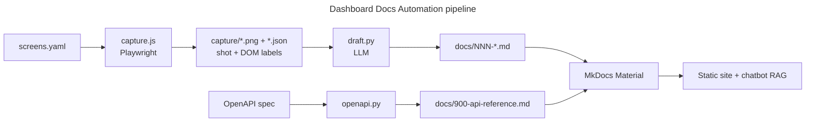

# Dashboard Docs Automation

> Turn any web dashboard into a screenshot-rich documentation site, automatically.

<p align="center">
  <!-- Version badge is static: keep in sync with the VERSION file on release. -->
  <a href="https://github.com/ConsultingFuture4200/dashboard-docs-automation/releases"></a>
  <a href="LICENSE"></a>
  
  
  
</p>

Captures every screen of a dashboard (screenshot + real DOM labels), drafts a grounded explanation for each with an LLM, and generates an API reference from the app's OpenAPI spec, all assembled into a searchable [MkDocs Material](https://squidfunk.github.io/mkdocs-material/) site. The same Markdown doubles as a knowledge base for a support chatbot (RAG).


<!-- TODO: Replace DOCS_SITE_SCREENSHOT_URL with a screenshot of your generated docs site -->

## Quick Start

> [!TIP]
> First time here? Follow **[QUICKSTART.md](QUICKSTART.md)** — a step-by-step walkthrough from clone to your first generated page, with "what you should see" checkpoints and per-provider LLM setup (OpenAI, Ollama, vLLM/llama.cpp).

> [!IMPORTANT]
> Requires Node.js 18+, [uv](https://docs.astral.sh/uv/), and an OpenAI-compatible LLM endpoint (a local server such as vLLM or llama.cpp works).

```bash
git clone https://github.com/ConsultingFuture4200/dashboard-docs-automation.git
cd dashboard-docs-automation
make setup                              # Node + Playwright Chromium + MkDocs (uv venv)
cp config.example.yaml config.yaml      # then set baseUrl + auth
cp screens.example.yaml screens.yaml    # then list your screens
make doctor                             # preflight: tools, config, connectivity
```

```bash
make capture                                                      # screenshot + DOM every screen
OPENAI_BASE_URL=http://localhost:8000/v1 DOCS_MODEL=your-model make draft
make api                                                          # API reference from OpenAPI spec
make serve                                                        # preview at http://127.0.0.1:8000
```

<details>
<summary>Features & workflow</summary>

### Features

- **Grounded capture** — Playwright saves each screen's screenshot *and* its real DOM text and control labels, so drafts use your actual button and field names instead of guessing from pixels.
- **Inner-scroll aware** — expands panels that scroll independently of the page body, freezes persistent side rails, and caps very tall list/log pages so screenshots stay doc-sized.
- **Any LLM** — talks to any OpenAI-compatible endpoint. Vision models read the screenshot; text-only models draft from the DOM (`DOCS_NO_IMAGE=1`).
- **Exact API reference** — generated straight from an OpenAPI spec, no LLM, regenerates instantly.
- **Markdown-first** — the same files render the docs site and feed a chatbot's retrieval index.

### What's automated vs. manual

| Stage | Tool | Automated |
|-------|------|-----------|
| List screens | `screens.yaml` | Manual (the one file you maintain) |
| Log in, if needed | `auth.js` | One-time interactive |
| Screenshot + DOM capture | `capture.js` | Yes |
| Draft per-screen pages | `draft.py` | Yes (LLM), then you review |
| API reference | `openapi.py` | Yes, from the spec |
| Build and search | MkDocs Material | Yes |

> [!NOTE]
> The LLM drafts get you most of the way; review each page before it feeds a customer-facing chatbot. That human pass is where accuracy comes from.

</details>

<details>
<summary>Auditing accuracy</summary>

Because the drafts are LLM-written, the pipeline includes a three-layer audit that
compares the docs against the ground truth captured at collection time. Each layer
catches a different failure mode:

| Layer | Command | Catches | Needs |
|-------|---------|---------|-------|
| **1. Cross-check** | `make audit` | Hallucinated elements, coverage gaps | Nothing (deterministic) |
| **2. Live verify** | `make verify` | Broken navigation, drift vs the running app | App reachable |
| **3. Semantic judge** | `make judge` | Wrong descriptions, unsupported claims | An LLM endpoint |

```bash
make audit        # deterministic: docs vs captured DOM labels -> audit/report.md
make judge        # LLM judge: docs vs ground truth -> audit/semantic-report.md
make verify       # live: re-run screen steps, check elements -> audit/live-report.md
make audit-all    # all three (verify needs the tunnel open)
```

> [!WARNING]
> Audit reports are written under `audit/`, which is gitignored because captured
> DOM can contain real user data.

</details>

<details>
<summary>Architecture</summary>



Two tracks feed one site: **screens** go through capture and LLM drafting; the **API reference** is generated directly from the spec.

</details>

<details>
<summary>Configuration</summary>

`config.yaml` controls capture and drafting:

| Option | Type | Default | Description |
|--------|------|---------|-------------|
| `baseUrl` | string | — | Root URL of the running dashboard |
| `auth` | bool | `true` | Require a saved login session (`false` for open apps) |
| `expandScroll` | bool | `true` | Grow inner-scrolling panels to full height before shooting |
| `freezeSelectors` | list | `[aside]` | Side panels to pin so they don't inflate every page |
| `maxHeightPx` | int | `4000` | Cap screenshot height so long lists stay doc-sized |
| `openapiUrl` | string | — | OpenAPI spec URL for the API reference (optional) |
| `productDescription` | string | — | One line injected into the drafting prompt so pages describe the right product |

Screens are listed in `screens.yaml`, one entry per screen with the steps to reach it (`goto`, `click`, `fill`, `waitFor`, `hover`, `press`, `wait`). Path-routed SPAs usually need a single `goto`.

> [!WARNING]
> Screenshots and captured DOM can contain real user data. `capture/`, `docs/img/`, generated `docs/NNN-*.md`, and `site/` are gitignored so they are never committed. If you host the site, gate it behind authentication or redact PII first.

</details>

<details>
<summary>Commands</summary>

```
make setup     Node + Python deps + browser
make doctor    preflight check: tools, config, connectivity
make auth      one-time login, saves a session
make capture   screenshot + DOM capture every screen
make draft     LLM-draft a page per screen
make api       API reference from the OpenAPI spec
make audit     Layer 1 accuracy audit (deterministic)
make judge     Layer 3 accuracy audit (LLM judge)
make verify    Layer 2 accuracy audit (live app)
make serve     preview the docs site
make build     build the static site into ./site
make deploy    build and deploy ./site to Vercel
```

</details>

## Releases

Tagged versions live on the [Releases page](https://github.com/ConsultingFuture4200/dashboard-docs-automation/releases); see [CHANGELOG.md](CHANGELOG.md) for what changed in each.

## License

[MIT](LICENSE) © ConsultingFuture4200
